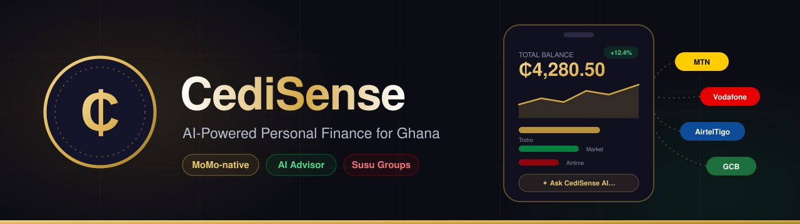
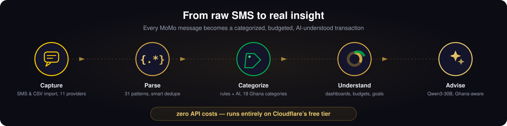
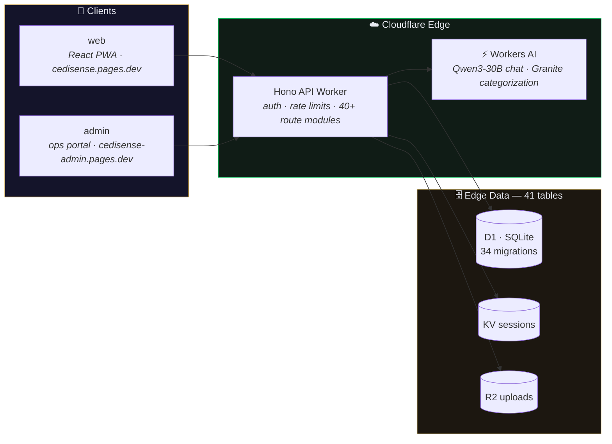

<div align="center">



*Smart money management built for Ghanaians, by Ghanaians.*

[](https://cedisense.pages.dev/)
[](https://hodgesandco.com)

[](https://workers.cloudflare.com)
[](https://react.dev)
[](https://typescriptlang.org)
[](https://hono.dev)

</div>

**CediSense** is an AI-powered personal finance platform designed specifically for Ghana's financial ecosystem. Unlike Plaid-based tools built for US/EU markets, CediSense is architected around **Mobile Money** (MTN MoMo, Vodafone Cash, AirtelTigo) and **local banks** — with AI advice contextualized to the Ghanaian economy.

---

## Why CediSense?

Plaid doesn't operate in Ghana. Mobile Money has **74+ million** registered accounts. No existing tool serves this market well.

CediSense fills that gap with:

- **SMS & CSV Import** — Parse transaction messages from 11 Ghanaian providers (MTN MoMo, Vodafone Cash, AirtelTigo, GCB, Ecobank, Fidelity, Stanbic, Absa, CalBank, UBA, Zenith)
- **AI Chat Advisor** — Conversational financial guidance powered by Qwen3-30B, with full context of your spending patterns, budgets, and goals
- **Susu Groups** — Digital rotating savings with trust scores, early-payout voting, penalties, and group chat
- **Smart Categorization** — Rule-based + AI auto-categorization across 18 Ghana-contextualized categories
- **Visual Dashboard** — Income vs expenses, daily spending trends, category breakdowns with Recharts
- **Budgets & Goals** — Monthly per-category spending limits and savings goals with progress tracking
- **Zero API Costs** — Runs entirely on Cloudflare's free tier (Workers AI, D1, KV, Pages)

<div align="center">

</div>

---

## Architecture



### Tech Stack

| Layer | Technology |
|-------|-----------|
| **Frontend** | React 18, Vite, Tailwind CSS, Recharts, TypeScript |
| **API** | Hono on Cloudflare Workers |
| **Database** | Cloudflare D1 (SQLite at the edge) — 41 tables, 34 migrations |
| **Cache/Sessions** | Cloudflare KV |
| **File Storage** | Cloudflare R2 |
| **AI Models** | Qwen3-30B-A3B (chat), Granite Micro (categorization) |
| **Auth** | Phone + 4-digit PIN, JWT, httpOnly refresh cookies |
| **Hosting** | Cloudflare Pages (web + admin) |
| **Monorepo** | pnpm workspaces + Turbo |

---

## Project Structure

```
CediSense/
├── apps/
│   ├── api/                    # Cloudflare Worker (Hono)
│   │   ├── migrations/         # 34 D1 SQL migrations
│   │   └── src/
│   │       ├── routes/         # API endpoints — incl. susu/ suite & admin/
│   │       ├── lib/            # Shared utilities
│   │       └── middleware/     # Auth, CORS, rate limiting
│   ├── web/                    # React frontend (Vite) → cedisense.pages.dev
│   │   └── src/
│   │       ├── pages/          # Route pages
│   │       ├── components/     # UI components
│   │       ├── contexts/       # React contexts
│   │       ├── hooks/          # Custom hooks
│   │       └── lib/            # Utilities
│   └── admin/                  # Ops/admin portal (Vite) → cedisense-admin.pages.dev
├── packages/
│   └── shared/                 # Shared types, schemas, formatters
│       └── src/
│           ├── types.ts        # TypeScript interfaces
│           ├── schemas.ts      # Zod validation
│           ├── format.ts       # GHS/pesewas formatting
│           ├── sms/            # SMS parsing engine
│           └── csv/            # CSV parser
└── docs/
    ├── assets/                 # README illustrations (SVG)
    └── superpowers/
        ├── specs/              # Design specifications
        └── plans/              # Implementation plans
```

---

## Features

### Transaction Management
- Manual entry with category and account selection
- SMS import from 11 Ghanaian providers (31 regex patterns)
- CSV bank statement import (MTN MoMo, GCB, Ecobank, Stanbic, Absa, Generic)
- Two-step import flow: parse/preview then confirm/persist
- Smart deduplication (reference match + fuzzy fallback)
- Recurring transactions with automatic candidate detection

### 🤝 Susu Suite — digital rotating savings
- **Susu groups** with member roles, payout ordering, and pre-paid member tagging
- **Trust scores** per member driven by contribution history
- **Early payouts** with group voting, plus penalties for defaults
- **Group chat** — attachments, reactions, pins, read receipts, member colors, "while you were away" presence separator
- **Gamification** — badges, streaks, and milestones
- **Specialized variants** — funeral fund with claim voting, welfare fund, guarantee fund, school-fees plans, agricultural cycles, bulk purchase, diaspora contributions
- **Collector mode** — profiles, client books, deposits, and payouts for traditional susu collectors

### AI Chat Advisor
- Streaming responses (SSE) powered by Qwen3-30B-A3B
- Rich financial context: balances, spending, categories, budgets, goals
- Ghana-aware advice: MoMo fees, susu culture, local costs, T-Bills
- Persistent chat history with 15-message context window
- Soft daily usage limit (40 messages/day) with warning

### Dashboard & Insights
- Month-by-month navigation with client-side caching
- Total balance across all accounts with per-account pills
- Income vs expenses summary with net calculation
- Daily spending trend (Recharts area chart)
- Category breakdown (donut chart + ranked list with drill-down)
- Recent transactions with expandable details

### Budgets
- Monthly per-category spending limits
- Real-time spending tracking via transaction queries
- Visual status: green (on track), gold (warning at 80%), red (exceeded)
- Aggregate summary bar across all budgets
- AI advisor is aware of budget status

### Savings Goals
- Named goals with target amounts and optional deadlines
- Manual contributions with progress tracking
- Deadline awareness (days remaining / overdue)
- Celebration state when goal is reached
- AI advisor is aware of goal progress

### More
- **IOUs** — track money lent and borrowed
- **Investments** — T-Bills and local investment tracking
- **Notifications** — web push (VAPID) with per-user preferences
- **Admin portal** — operations dashboard with audit log
- **Categorization** — 18 Ghana-contextualized defaults, rule engine, AI fallback, custom rules

---

## Getting Started

### Prerequisites

- [Node.js](https://nodejs.org/) v18+
- [pnpm](https://pnpm.io/) v8+
- [Wrangler](https://developers.cloudflare.com/workers/wrangler/) CLI

### Installation

```bash
# Clone the repository
git clone https://github.com/ghwmelite-dotcom/CediSense.git
cd CediSense

# Install dependencies
pnpm install

# Set up D1 database (local)
cd apps/api
npx wrangler d1 execute cedisense-db --local --file=migrations/0001_initial_schema.sql
npx wrangler d1 execute cedisense-db --local --file=migrations/0002_transactions.sql
npx wrangler d1 execute cedisense-db --local --file=migrations/0003_chat_messages.sql
npx wrangler d1 execute cedisense-db --local --file=migrations/0004_budgets_goals.sql
cd ../..

# Start development servers
pnpm dev
```

### Environment

Create `apps/api/.dev.vars` for local development:

```
JWT_SECRET=your-secret-here
ENVIRONMENT=development
```

---

## Testing

```bash
# Run all tests
npx vitest run

# Run with watch mode
npx vitest

# Type checking
pnpm -r run typecheck
```

**Current status:** 159 tests passing across 24 test files.

---

## Ghana-Specific Design

CediSense is **Ghana-first**, not a US fintech localization:

- **Currency:** All amounts in Ghana Cedis (₵), stored as INTEGER pesewas to avoid floating-point drift
- **Providers:** MTN MoMo, Vodafone Cash, AirtelTigo Money, GCB, Ecobank, Fidelity, Stanbic, Absa, CalBank, UBA, Zenith
- **Categories:** Trotro, Market Shopping, Family Support, Church Tithes, Airtime & Data, Susu, ECG/Utilities
- **AI Context:** MoMo fee structures, susu savings culture, market day patterns, T-Bills, local cost awareness
- **Language:** English (with Twi, Ewe, Dagbani support planned)

---

## Roadmap

- [x] **Phase 1: MVP** — Auth, Transactions, Dashboard, AI Chat, Budgets & Goals
- [x] **Phase 2: Smart Features** — Recurring detection, IOUs, investments, notifications
- [x] **Phase 3: Susu Suite** — Groups, trust scores, chat, gamification, specialized funds, collector mode
- [ ] **Phase 4: Growth & Polish** — Twi language, offline support, bill reminders, PDF reports
- [ ] **Phase 5: Future** — MTN MoMo API, WhatsApp bot, deeper investment tracking

---

## License

Proprietary. All rights reserved by Hodges & Co. Limited.

---

<div align="center">

**Built with care by [Hodges & Co.](https://hodgesandco.com)**

*Empowering Ghanaians to take control of their finances.*

</div>
